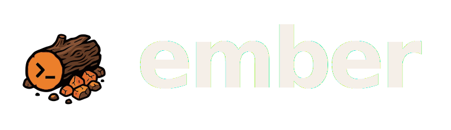

<div align="center">



### Keep your session warm.

**The open-source coding agent — Claude Code + Codex — that runs inside _your own_ AWS account.**

[](LICENSE)
[](#the-wedge)
[](#the-wedge)
[](#stand-it-up-one-command)
[](#open-core)

</div>


---

Hand Ember a repo and a task at your desk. Close the laptop. The session keeps running
on a **warm micro-VM in your cloud** — not ours. Reopen on the web on your walk to a
meeting, course-correct from your phone over lunch, pull it back home at night. The work
never goes cold, and you get to be outside while the loop runs.

A campfire doesn't go out when you walk away. Bank it right and the embers hold their heat
for hours. **Your session is the ember** — and the product actually tracks it: every session
carries a **warm / idle / cold** state, on a persistent EFS workspace that's still there when
you come back. The name isn't a metaphor bolted on; it's the mechanic.

## The wedge

The incumbents host this on *their* clouds (OpenAI bought Gitpod/Ona for exactly this;
Claude Code on the web runs on Anthropic-managed infrastructure). Ember is the open,
self-hosted alternative: **same capability — your code, your keys, your bill, your model.
Nothing leaves your account.**

- **Bring your own plan** — run on the Claude Pro/Max or ChatGPT plan you *already pay for*.
  **$0 marginal LLM cost.**
- **Or Amazon Bedrock** — pay-per-token, fully in-VPC, nothing leaves your account. Built
  for compliance.
- **Model-agnostic** — Claude *and* Codex, switchable per session.
- **Resumable everywhere** — persistent EFS workspace per session; warm / idle / cold
  warmth dots; deep links to any device.

```
laptop (Claude Code / Codex)  ──port──▶  ember  ──pull──▶  laptop
                                         (AgentCore micro-VM, your account)
```

## Stand it up (one command)

```bash
export AWS_PROFILE=<your-profile>      # creds for the target account
git clone https://github.com/tycenjmccann/ember.git && cd ember
npm install
./install.sh
```

`install.sh` is idempotent and stands up everything end to end — DynamoDB + S3, the IAM
execution role, VPC private subnets with a NAT gateway for runtime egress + an EFS workspace,
the AgentCore coding runtime (Claude Code + Codex), and a public App Runner URL. It prints
the live URL at the end.

> **Account guard.** Set `EXPECTED_ACCOUNT_ID` in `.env.local` and the deploy refuses to
> run against any other account — protection against a wrong profile.

## Open-core

MIT self-host, free, forever — the proof it runs in *your* account. The enterprise tier
(SSO, VPC/PrivateLink, per-user secret isolation, audit export, admin console) is the paid
layer. Same playbook as GitLab and Supabase. See [`docs/ENTERPRISE.md`](docs/ENTERPRISE.md).

---

<div align="center">

**Close the lid. It's still burning.**

</div>

---

## What it costs

Infrastructure is a rounding error; the LLM is ~95% of total cost — and **$0
marginal if you connect your own plan.** Rough monthly, using current AWS rates:

| Piece | Rate | Small team |
|---|---|---|
| App Runner (1 vCPU / 2 GB) | $0.064/vCPU-hr + $0.007/GB-hr | ~$15–25 (pauseable to ~$0) |
| AgentCore runtime | $0.0895/vCPU-hr, idle CPU free | ~$0.05–0.12 per active session-hour |
| DynamoDB + S3 | on-demand | cents |
| **LLM (Bedrock)** | per token | $2–20 / heavy session |
| **LLM (your plan)** | — | **$0 marginal** |

A live calculator ships in the app at **`/cost`** — plug in devs, sessions/day, and
model to see your number.

## Run / develop locally

```bash
npm install
AWS_PROFILE=<your-profile> npm run dev          # http://localhost:3000
```

> The app uses Next.js `output: standalone`. For local production runs use
> `npm run dev`; production is served by the App Runner container (`Dockerfile`).

## What's in the repo

| Path | What |
|---|---|
| `src/app/ember/` | The UI — session sidebar, chat stream, live terminal, account/config sheets. |
| `src/app/cost/` | In-app cost calculator. |
| `src/app/api/ember/` | API routes: sessions CRUD, message (stream + buffered), shell presign, warm, checkpoint, port, config, auth. |
| `src/lib/ember/` | Runtime client, DynamoDB session store, S3 config/auth stores, shell wire protocol. |
| `deploy/` | `install.sh` building blocks: stores, IAM role, VPC/EFS, runtime, App Runner. |
| `deploy/coding-agent-runtime/` | The AgentCore runtime image + deploy (Claude Code + Codex, EFS workspace, OTel). |
| `mcp/port-session/` | Local stdio MCP server — `port`, `pull`, `sync-config`, `login` tools. |
| `docs/ENTERPRISE.md` | The VPC/SSO/audit hardening path for company-wide rollout. |

## Features

- **Chat** with a cloud coding agent — Claude Code (streamed) or Codex (buffered).
- **Live terminal** — xterm.js over a presigned `wss://` straight to the session
  microVM. The browser talks to AgentCore directly; the server only signs the URL.
- **Resumable sessions** — each maps to a warm microVM + persistent EFS workspace;
  warmth dots (warm/idle/cold) in the sidebar.
- **Bring your own plan** — connect a Claude Pro/Max or ChatGPT login and cloud
  sessions run on it instead of Bedrock. Set it in-app or via the MCP `login` tool.
- **Port to cloud / pull home** — hand a live laptop session to the cloud
  (commit+push, ship the raw transcript, native `claude --resume`), then bring the
  grown session back.
- **CLI config sync** — mirror your local Claude/Codex setup (CLAUDE.md, skills,
  agents, MCP servers) so cloud sessions are a clone of your laptop.
- **Deep links** — `/ember?session=<id>[&view=terminal]` opens a ported
  session on any device. Dark/light theme, mobile-first iOS-native UI.

## MCP server (laptop ⇄ cloud handoff)

```bash
npm run mcp:build      # builds mcp/port-session/dist
```

Register it with your local Claude Code (`~/.claude.json` → `mcpServers`) — see
[`mcp/port-session/README.md`](mcp/port-session/README.md) for the config block and
the full tool reference (`port`, `pull`, `sync-config`, `login`).

## Going to production / company-wide

Out of the box this is single-user (`userId: "default"`) with no auth on the API —
fine for a personal deployment behind a private URL, **not** for multi-tenant or
public exposure. The path to SSO, per-user IAM scoping, VPC/PrivateLink isolation,
and audit export is laid out in [`docs/ENTERPRISE.md`](docs/ENTERPRISE.md).

## License

MIT — see [LICENSE](LICENSE).
