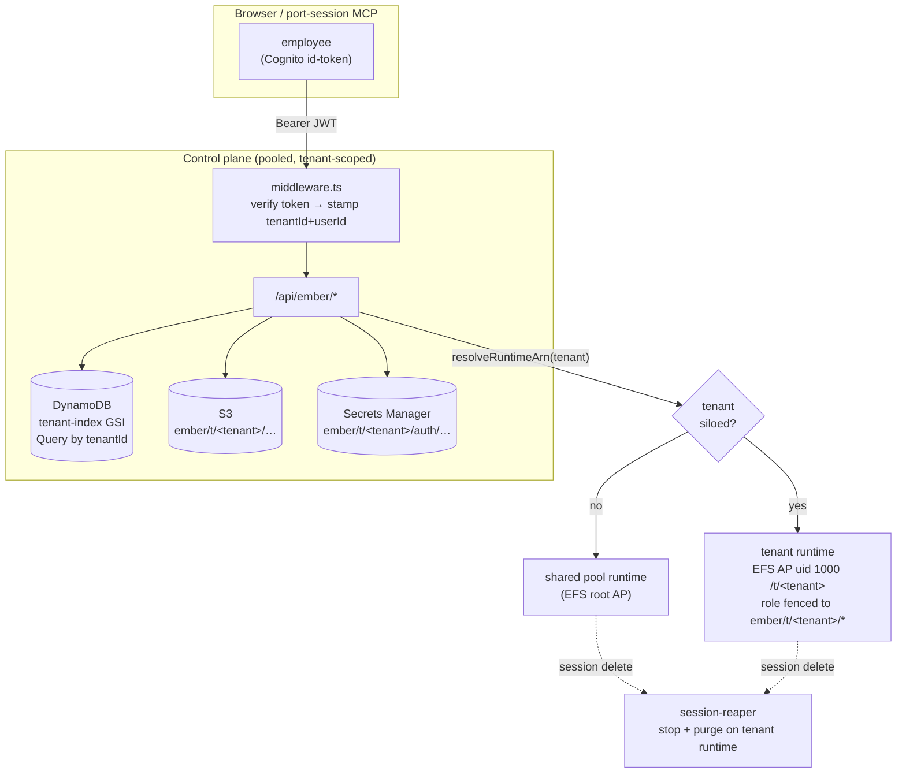

# Ember for the enterprise

The wedge in one sentence: **Claude Code / Codex on the web, running inside your
own AWS account** — your code, your credentials, your audit logs, your model
choice. This doc covers the multi-tenant architecture that ships today and the
remaining gap list to a full company-wide rollout, plus why that posture matters
right now.

## Why now

| Offering | Where the agent runs | Model | Your code leaves your account? |
|---|---|---|---|
| Claude Code on the web | Anthropic-managed cloud | Claude only | Yes |
| OpenAI Codex + Ona/Gitpod (acq. Jun 2026) | OpenAI-managed cloud | OpenAI only | Yes |
| **Ember (this)** | **Your AWS account** | **Claude *and* Codex *and* Bedrock** | **No** |

The incumbents validated the category and then locked it to their cloud + their
model. The unmet enterprise ask — *"can the agent run in our VPC, on our bill, on
the model our compliance team approved, with logs in our CloudWatch?"* — is exactly
what this answers. Post-Ona, every platform/security team is asking it.

## What ships today

- Per-session coding microVM (Amazon Bedrock AgentCore Runtime) with a persistent
  EFS workspace — clone, build, commit, PR, resume.
- Two cost models per session: Amazon Bedrock (pay-per-token, in-account) **or**
  bring-your-own Claude/ChatGPT plan ($0 marginal LLM).
- Live web terminal over a presigned `wss://` straight to the microVM.
- Laptop ⇄ cloud session handoff (the `port-session` MCP).
- One-command install into a fresh account (`install.sh`).
- **Multi-tenant auth + tenant isolation** (the four phases below) — Cognito gate,
  per-tenant data + storage scoping, opt-in per-tenant compute silos, and
  Secrets Manager credentials. See the architecture below.

## Multi-tenant architecture

A tenant = a company (`custom:tenantId`); a user = an employee (Cognito `sub`).
The **control plane is pooled** (one App Runner app, one DynamoDB table, one
bucket — all scoped by tenant), and the **compute plane is silo-on-demand**: a
tenant runs on the shared pool runtime until you provision it a dedicated one.



**The four isolation layers (all merged):**

| Layer | Boundary | Mechanism |
|---|---|---|
| Auth | request → identity | Cognito admin-create-only pool; `middleware.ts` verifies the id-token and stamps `tenantId`/`userId` (routes never trust a client header) |
| Data | DynamoDB | `tenant-index` GSI → `listSessions` Querys one tenant; point reads ownership-checked |
| Storage | S3 + Secrets Manager | every artifact under `ember/t/<tenantId>/…`; subscription creds in Secrets Manager (KMS), materialized to **tmpfs** (`/dev/shm`) — Claude token directly, Codex `auth.json` via a tmpfs symlink — never the shared EFS |
| Compute | AgentCore runtime + EFS | opt-in silo: dedicated runtime, EFS access point (non-root uid 1000, private root dir), runtime role fenced to the tenant's S3 + secret prefix |

Pooled tenants share one runtime + EFS + role and are isolated only logically —
**provision a silo (`deploy/provision-tenant.sh <id>`) per tenant before
onboarding mutually-untrusted companies.**

## The gap to enterprise-ready

Ordered by what unblocks a paid pilot fastest.

### 1. Authentication + multi-tenancy  *(shipped)*
Cognito **admin-create-only** user pool (no self-signup), Hosted-UI sign-in, and a
JWT gate (`src/middleware.ts`) on every route. **Session** rows carry `tenantId`
(company) + `userId` (`sub`) and are listed via the `tenant-index` GSI; point reads
are ownership-checked. (`config:{userId}` / `auth:{userId}` metadata rows are keyed
by the globally-unique userId, not tenant-stamped — tenant-scoped DDB cleanup applies
to session rows; metadata rows are removed with their user at offboarding.)
`EMBER_AUTH_DISABLED=1` keeps the personal single-user mode; the deploy **fails
closed** if neither auth nor that flag is set.
- **SSO / federation:** SAML & OIDC federation to the customer's IdP
  (Okta/Entra/Google/Ping/OneLogin/Cloudflare Access) ships via
  `deploy/cognito/add-idp.sh` + a direct-link `?idp=` param — one command, no
  redeploy. See [docs/SSO.md](SSO.md). **Still open:** company-wide tenant grouping
  (a Pre-Token-Generation Lambda stamping `custom:tenantId` per IdP) — optional,
  since per-user isolation holds without it.

### 2. Network isolation  *(the core enterprise selling point)*

**Runs in your existing VPC. Creates only EFS. Never modifies your route tables.**
That's the headline for a security review: the install is non-destructive to your
networking. Set your VPC + two private subnets and `install.sh` provisions only an
encrypted EFS workspace + an NFS security group inside them — no NAT, no route-table
changes, nothing in your account mutated.

```bash
export CODING_VPC_ID=vpc-xxxxxxxx
export CODING_PRIVATE_SUBNET_1=subnet-aaaaaaaa   # private, egress via your NAT/proxy
export CODING_PRIVATE_SUBNET_2=subnet-bbbbbbbb   # second AZ (EFS mount targets are per-AZ)
./install.sh
```

If you DON'T set those, install falls back to **provisioned mode**: it carves two
private subnets + a NAT gateway for you (greenfield accounts). Either way the coding
runtime runs in-VPC with a private-IP-only ENI.

**BYO-egress preflight** — the supplied subnets must satisfy:
- A `0.0.0.0/0` default route to your **NAT gateway, transit gateway, or egress
  appliance** (install verifies this and fails loudly if absent — AgentCore ENIs are
  private-IP-only, so a public/IGW subnet gives them no egress).
- **Two distinct AZs** (EFS mount targets are per-AZ; one per subnet).
- Outbound **TCP 2049** allowed within the runtime security group (for NFS to EFS).
- **DNS resolution + DNS hostnames enabled** on the VPC.
- That egress can reach **github.com** (Ember clones repos over HTTPS — there is no
  VPC endpoint for GitHub; a NAT or a proxy allowlisting github.com is required),
  plus the AWS endpoints the runtime uses (Bedrock, ECR, CloudWatch).

**IAM the install needs in BYO mode** (no route-table writes): `ec2:CreateSecurityGroup`,
`ec2:AuthorizeSecurityGroupIngress`, `ec2:Describe*`, and scoped `elasticfilesystem:*`
(create filesystem / mount targets / access point). Provisioned mode additionally
needs `ec2:CreateSubnet`, `ec2:*NatGateway*`, `ec2:*RouteTable*`, `ec2:AllocateAddress`.

**Further hardening (optional):**
- Put App Runner behind a **VPC connector**; reach DynamoDB/S3/Bedrock over **VPC
  endpoints (PrivateLink)** so AWS-service traffic skips the public internet (this
  reduces NAT traffic but does NOT replace it — GitHub still needs real egress).
- Restrict the runtime's egress to an allowlist of approved Git hosts / package
  registries via your proxy or NAT-fronted firewall.
- Private App Runner ingress + WAF, or front with an internal ALB.

### 3. Per-tenant credential + storage isolation  *(shipped)*
- All artifacts (config bundles, ported transcripts, bundles, checkpoints) live
  under `ember/t/<tenantId>/…` in S3.
- Subscription tokens move to **AWS Secrets Manager** (`EMBER_SECRETS_BACKEND=secretsmanager`,
  one secret per tenant/user/CLI, KMS-at-rest). Default `s3` backend keeps the
  prior behavior for personal deploys. Both creds are materialized to **tmpfs**
  (`/dev/shm`), never the shared EFS: the Claude PTY token directly, and the Codex
  `auth.json` via a tmpfs file that `$CODEX_HOME/auth.json` symlinks to (the `codex`
  CLI reads through the link; only the symlink lives on EFS).
- A **siloed tenant's runtime role is fenced** to `ember/t/<tenantId>/*` for both
  S3 and its own secret prefix, and its EFS access point forces non-root uid 1000
  on a private root dir — so a session can physically reach only its tenant's bytes.
- Offboarding (`deploy/offboard-tenant.sh <id>`) removes users, purges sessions,
  deletes the tenant's secrets + S3 prefix, and tears down its silo.
- **Still open:** short-lived, scoped GitHub tokens (GitHub App installation tokens)
  instead of the single shared PAT.

### 4. Audit + observability  *(compliance)*
- OTel → CloudWatch tracing already exists. Add an **immutable audit log** (every
  turn, shell command, file write, model + token count) to a dedicated, write-once
  store the customer owns.
- CloudTrail data events on the artifact bucket; per-session cost attribution via
  AgentCore metrics tagged by `userId`/team.

### 5. Cost governance
- Per-user / per-team **budget caps** and quotas (sessions/day, tokens/month);
  pause or downgrade model when exceeded.
- Default to "bring your own plan" for ICs (eliminates LLM spend); reserve Bedrock
  for compliance-restricted repos.

### 6. Admin surface
- Org dashboard: users, active sessions, spend, audit search.
- Repo allowlist, model allowlist, SSO group → permission mapping.

## Suggested rollout

1. **Pilot (single team, private):** items 1–3 ship today — Cognito auth, tenant
   data/storage scoping, per-tenant compute silos, VPC isolation. This is the demo
   that closes a security review. Provision a silo per tenant for untrusted companies.
2. **Department:** item 4 (audit export) + IdP federation (item 1's open piece).
3. **Org-wide:** items 5–6. Budgets, admin console, AWS Marketplace listing for
   procurement-friendly purchasing and co-sell.

## Business model

Open-core. The self-host build stays MIT and free — it's the top-of-funnel and the
proof the thing runs in *your* account. The enterprise tier (SSO, VPC/PrivateLink,
per-user secret isolation, audit export, admin console, support SLA) is the paid
layer, sold per-seat or via AWS Marketplace. Same playbook as GitLab / Supabase.
